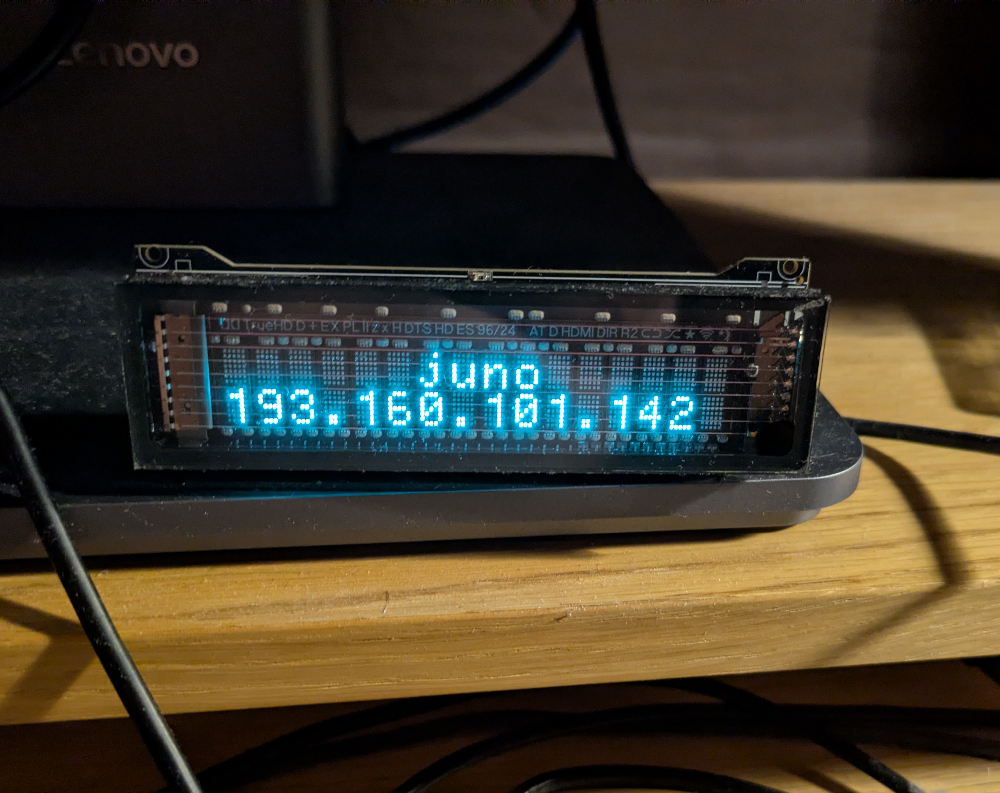
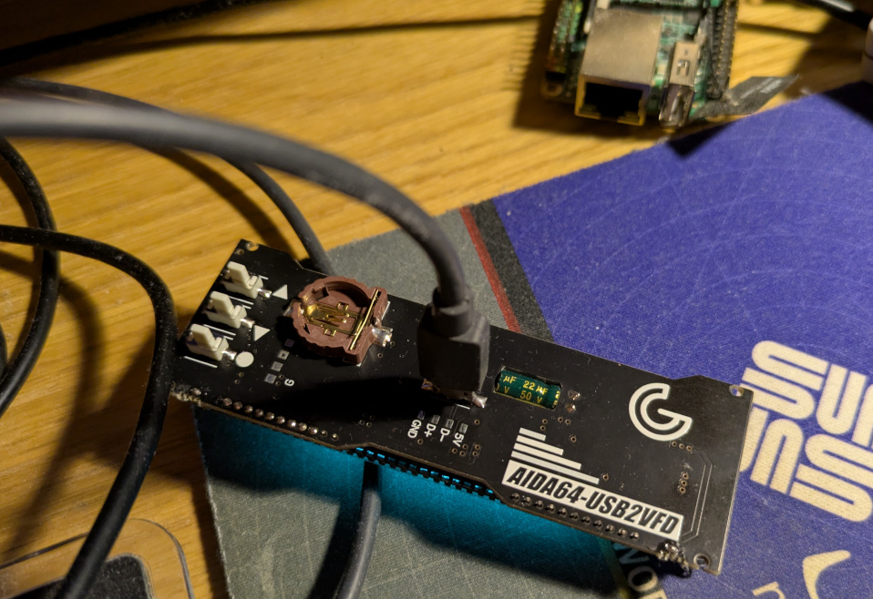

# USB2VFD - Linux Driver for AIDA64 VFD Displays

Control cheap Chinese USB VFD (Vacuum Fluorescent Display) clones from Linux.
Mine was branded "Kissbuyer" on AliExpress with markings of "AIDA64-USB2VFD".




## Credits

Protocol reverse-engineered thanks to this excellent video by **upir**:
- YouTube: [VFD Display Testing](https://www.youtube.com/watch?v=g7SOxzKatCc)
- The video documents sniffing AIDA64's serial communication to understand the protocol

## Hardware

These displays are sold on AliExpress/eBay as:
- "AIDA64 Sub-screen VFD Display"
- "USB2VFD"
- "VFD Clock USB2VFD AIDA64 Chassis Display"

### Specifications
| Property | Value |
|----------|-------|
| Display Type | VFD (Vacuum Fluorescent Display) |
| Resolution | 15x2 characters (some are 40x2) |
| USB Chip | CH340 (USB-to-Serial) |
| USB ID | `1a86:7523` |
| Baud Rate | 9600 |
| Protocol | Matrix Orbital LK (partial) |
| Internal Buffer | 20 chars per line |

### Identifying Your Display
```bash
lsusb | grep CH340
# Bus 001 Device 002: ID 1a86:7523 QinHeng Electronics CH340 serial converter

ls /dev/ttyUSB*
# /dev/ttyUSB0 or /dev/ttyUSB1
```

## Protocol

These displays use a subset of the Matrix Orbital LK protocol:

| Command | Bytes | Description |
|---------|-------|-------------|
| Go Home | `0xFE 0x48` | Reset cursor to top-left |
| Clear Screen | `0xFE 0x58` | Clear display |
| Set Position | `0xFE 0x47 <col> <row>` | Move cursor (1-indexed) |
| Set Brightness | `0xFE 0x99 <val>` | 0-255 (may not work on clones) |

### Display Memory Layout (15x2 display)
```
Offset 0-14:  Line 1 (visible)
Offset 15-19: Line 1 (not visible, padding)
Offset 20-34: Line 2 (visible)
Offset 35-39: Line 2 (not visible, padding)
```

### Important Notes

1. **Continuous refresh required**: Display reverts to "AIDA64" intro screen after ~2 seconds of inactivity
2. **Send full buffer**: Best results when sending `Go Home` + 40 characters at once
3. **Most commands don't work**: Custom characters, scrolling, etc. are non-functional on these clones

## Installation

### Dependencies
```bash
# Fedora/RHEL
sudo dnf install python3-pyserial

# Debian/Ubuntu
sudo apt install python3-serial

# Or via pip
pip install pyserial
```

### Permissions

Add yourself to the `dialout` group (or use udev rules):
```bash
sudo usermod -a -G dialout $USER
# Log out and back in
```

## Usage

### Python Library
```python
#!/usr/bin/env python3
import serial
import time

ser = serial.Serial('/dev/ttyUSB1', 9600, timeout=1)

def vfd_write(line1="", line2=""):
    ser.write(bytes([0xFE, 0x48]))
    l1 = line1[:15].center(15).ljust(20)
    l2 = line2[:15].center(15).ljust(20)
    ser.write((l1 + l2).encode())
    ser.flush()

# Must loop to prevent intro screen
while True:
    vfd_write("Hello", "World")
    time.sleep(0.5)
```

### Command Line Tool (`vfd.py`)
```bash
# One-shot (reverts to intro after ~2s)
./vfd.py "Hello" "World"

# Keep displaying (Ctrl+C to stop)
./vfd.py "Hello" "World" -k

# Show hostname and time
./vfd.py "$(hostname)" "$(date +%H:%M)" -k
```

### Daemon (`vfd-daemon.py`)

A background daemon with rotating screens and UDP input:

```bash
# Run with default screens (rotates every 30s):
#   Screen 1: Clock + date, load average, CPU temp
#   Screen 2: Hostname, external IP
./vfd-daemon.py

# Static text (left-aligned by default)
./vfd-daemon.py "Line 1" "Line 2"

# Static text, centered
./vfd-daemon.py "Line 1" "Line 2" -c

# Custom serial port
./vfd-daemon.py -p /dev/ttyUSB0

# Listen on LAN (default: localhost only)
./vfd-daemon.py -L

# UDP-only mode (blank until UDP received)
./vfd-daemon.py -u

# Custom freshness (seconds, 0 = infinite)
./vfd-daemon.py -f 300
```

#### UDP Input

Send text via UDP to add it to the screen rotation:

```bash
# Local
echo -e "Hello\nWorld" | nc -u localhost 5566

# From another machine (requires -L flag)
echo -e "Alert\nServer down" | nc -u 192.168.1.50 5566
```

- New UDP messages immediately interrupt rotation and display for 30s
- Content then joins the rotation for 12 hours (configurable with `-f`)
- Auto-centers unless you add leading/trailing spaces for manual positioning:

```bash
# Auto-centered
echo -e "ALERT\nServer down" | nc -u localhost 5566

# Left-aligned (leading space)
echo -e " ALERT\n Server down" | nc -u localhost 5566
```

#### Adding Custom Screens

Edit the `SCREENS` list in `vfd-daemon.py`:

```python
SCREEN_INTERVAL = 30  # seconds between screen changes

def screen_clock_stats():
    """Clock and system stats"""
    line1 = time.strftime('%H:%M:%S %d/%m')
    line2 = f"L:{get_load()} {get_cpu_temp()}"
    return (line1, line2)

def screen_host_ip():
    """Hostname and external IP"""
    line1 = socket.gethostname()[:15]
    line2 = get_external_ip()
    return (line1, line2)

def screen_udp():
    """UDP content (skipped if no fresh data)"""
    # ... returns None if no data

# Add/remove/reorder screens here (return None to skip):
SCREENS = [
    screen_clock_stats,
    screen_host_ip,
    screen_udp,
]
```

### Clock Display (one-liner)
```bash
python3 -c "
import serial, time
ser = serial.Serial('/dev/ttyUSB1', 9600)
while True:
    ser.write(bytes([0xFE, 0x48]))
    ser.write(time.strftime('%H:%M:%S').center(15).ljust(20).encode())
    ser.write(time.strftime('%Y-%m-%d').center(15).ljust(20).encode())
    ser.flush()
    time.sleep(0.5)
"
```

## Troubleshooting

### Display shows nothing
- Check USB connection: `lsusb | grep CH340`
- Check serial port exists: `ls /dev/ttyUSB*`
- Check permissions: `groups | grep dialout`

### Display shows intro screen immediately
- Your refresh loop isn't fast enough
- Reduce sleep to 0.3-0.5 seconds

### Garbled characters
- Verify baud rate is 9600
- Check your line padding (must be 20 chars per line for 15x2 displays)

### "Matrix Orbital LK" doesn't work in AIDA64/LCDproc
- These clones don't work with standard Matrix Orbital drivers
- They have CH340 chips instead of FTDI chips
- Use direct serial control as documented here

## Hardware Variations

Different sellers have different displays:

| Size | Buffer per line | Line 2 offset |
|------|-----------------|---------------|
| 15x2 | 20 chars | 20 |
| 40x2 | 40 chars | 40 |

To find your line 2 offset, test different values:
```python
for offset in [15, 16, 20, 24, 32, 40, 64]:
    ser.write(bytes([0xFE, 0x48]))
    data = f'LINE1' + ' ' * (offset - 5) + 'LINE2'
    ser.write(data[:80].ljust(80).encode())
    time.sleep(3)
```

## License

MIT - Do whatever you want with this.

## See Also

- [Matrix Orbital LK Protocol](https://www.matrixorbital.com/manuals/LK_series_pdf.pdf) (reference, not fully compatible)
- [upir's VFD video](https://www.youtube.com/watch?v=g7SOxzKatCc) - Original reverse engineering
- [AIDA64 LCD Support](https://www.aida64.com/products/features/external-display-support)
